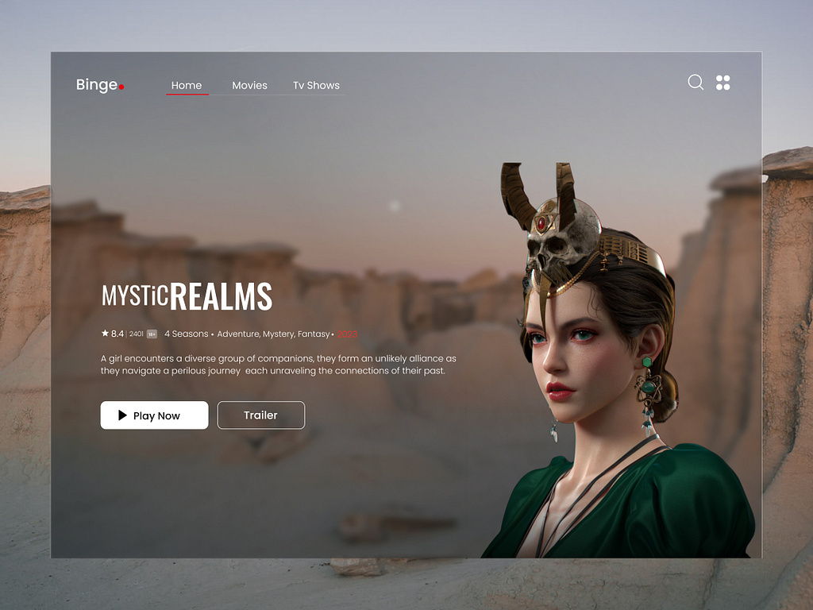

> movie streaming application using Reactjs




# To check the node version

```
node --version
```

# To install yarn using npm
```
npm install --global yarn
```

# To check yarn version
```
yarn --version
```

# To create a new react application using yarn
```
yarn create react-app movie-streamer
```

# Install react router dom
```
yarn add react-router-dom
```

# Install axios
```
yarn add axios
```

# To install react icons
```
yarn add react-icons
```

# To install react youtube
```
yarn add react-youtube
```

# To install movie trailer
```
yarn add movie-trailer
```

# To start react application
```
yarn start
```